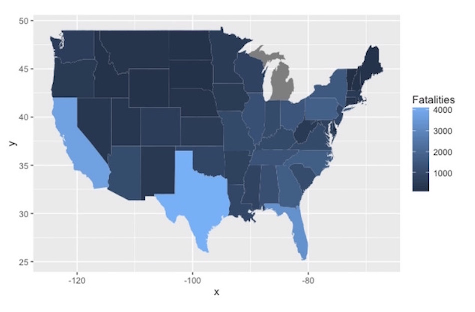

```{r setup, include=FALSE}
knitr::opts_chunk$set(echo = FALSE)
```

## BYOD instructions

If you have your own data, great! Dive in, share ideas and ask questions. 
If not, we have a github project with data and some starter code.

https://github.com/WestMichiganRUserGroup/August-2016-BYOD


